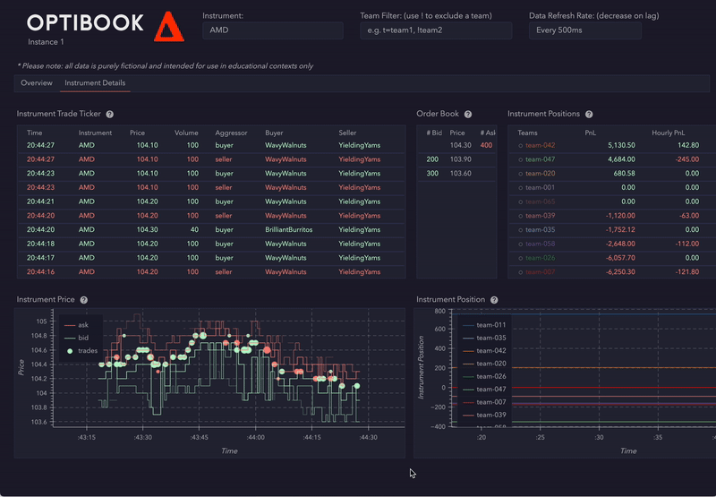

# 🤗 Optibook Algorithmic Trader 🤗

This repository contains the pseudocode structure of a multi-strategy algorithmic trading system developed during HackaTUM 2024, a hackathon at the Technical University of Munich. The actual trading logic has been redacted to avoid spoiling future competitions.

## Overview

The system implements multiple trading strategies that work together to identify and capture market opportunities:

1. **Market Making Strategy**

   - Provides continuous liquidity across multiple instruments
   - Features position-aware pricing and dynamic order sizing
   - Implements competitive quote management
   - Includes sophisticated risk management

2. **Basket Trading Strategy**

   - Arbitrages between ETFs and their underlying components
   - Calculates theoretical prices and identifies mispricings
   - Executes synchronized basket trades
   - Manages complex multi-leg positions

3. **Dual Listing Arbitrage**

   - Captures price discrepancies across different venues
   - Implements smart order routing
   - Features sophisticated failed order handling
   - Includes position risk management

4. **Balance Trading Strategy**

   - Statistical arbitrage between related instruments
   - Pairs trading implementation
   - Position neutrality management
   - Spread capture mechanics

5. **Dirty Hedge Strategy**
   - Complex multi-instrument arbitrage
   - Moving average-based price discovery
   - Position imbalance management
   - Multiple market scenario handling

## System Architecture

- **Rate Limiting**: Implements a sliding window rate limiter for exchange interactions
- **Risk Management**: Comprehensive position and exposure monitoring
- **Order Management**: Smart order routing and execution
- **Market Data**: Efficient order book processing
- **Position Tracking**: Real-time position and P&L monitoring

## Technical Details

- Written in Python
- Object-oriented design
- Modular strategy implementation
- Robust error handling
- Comprehensive logging
